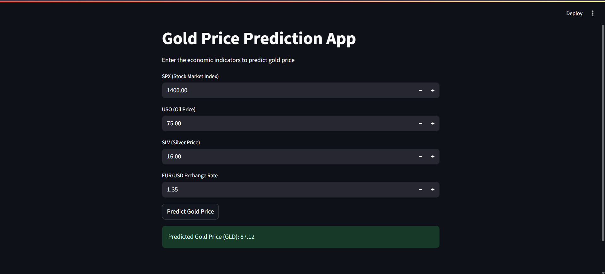

# Gold Price Prediction using Machine Learning

This project predicts gold prices using economic indicators such as stock market index, oil price, silver price, and currency exchange rate.

## Features
- Random Forest Regression Model
- Linear Regression Comparison
- Evaluation using R2, MAE, RMSE
- Streamlit Web App for Predictions

## Dataset Features
- SPX – Stock market index
- USO – Oil price
- SLV – Silver price
- EUR/USD – Currency exchange rate

## Model Performance

| Model | R2 Score | MAE | RMSE |
|------|------|------|------|
| Linear Regression | 0.865 | 5.91 | 8.41 |
| Random Forest | 0.989 | 1.33 | 2.39 |

Random Forest performed significantly better than Linear Regression.

## How to Run

Install dependencies:

pip install -r requirements.txt

Run the Streamlit app:

streamlit run app.py

## Technologies Used
- Python
- Scikit-learn
- Pandas
- Streamlit
- Matplotlib
- Seaborn

## Streamlit App Preview

## Project Structure

gold-price-prediction
│
├── Gold_Price_Prediction.ipynb
├── gld_price_data.csv
├── gold_model.pkl
├── app.py
├── requirements.txt
└── README.md
